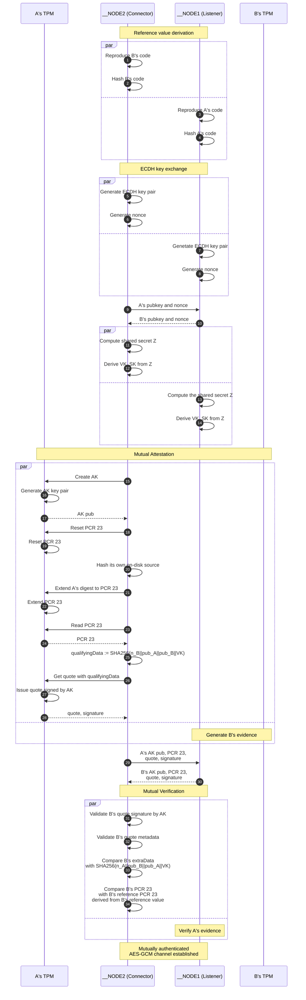

# Mutual Attestation PoC Implementation

This project provides a Proof of Concept (PoC) implementation of mutual attestation, where multiple nodes attest and verify to each other.
Each node verifies attestation evidence, including measurements from its peers, *without relying on any external reference value provider*.
To achieve this, the PoC uses the [PyReflect](https://github.com/acompany-develop/PyReflect) transpiler for mutual-referencing programming.

## Overview

Consider two nodes $A$ and $B$ attesting to each other.
The attestation evidence of each node includes its *measurement*, and the other node evaluate this by comparing its reference (expected) value.
In one-way attestation, the reference values can be provided in either of the following two ways:

1. Introduce a trusted third party, a *Reference Value Provider*, that distributes reference values to the verifier.
2. Hard-code the attester's reference measurements into the verifier's code in advance.

However, in the case of mutual attestation, the second method does not work, because embedding each other's reference values ​​leads to an infinite regress.
If one hard-codes each other's measurement values ​​into $A$ and $B$, their respective source codes change, and consequently, the measurement values ​​themselves also change.
Therefore, the hard-coded values ​​no longer match those measurement values.
Let's try replacing the embedded reference values ​​with the changed measurements. Then the measurements will change again.
This continues *ad infinitum*.

This PoC avoids the infinite regress by embedding the function that generates the reference source code at runtime, rather than embedding the value itself.
This enables each node to reconstruct the precise source of the peer node and derive the measurement value from it.
The reference value is derived internally rather than being obtained from an external source (such as a file, standard input, or the registry).

**Kleene's second recursion theorem** demonstrates that such source reconstruction is theoretically possible.
[PyReflect](https://github.com/acompany-develop/PyReflect), used in this PoC, is a Python transpiler that generates mutually referencing programs based on this theorem.

The PoC demonstrates post-handshake mutual attestation backed by TPM.
Two nodes performs TPM-backed mutual attestation after ECDH key exchange.

## Setup

### Dev Container

This repository includes a [Dev Container](https://containers.dev/), where all dependencies are pre-installed.
By opening the cloned repository using the IDE's Dev Containers extension, you can execute the PoC within a sandbox isolated from the host environment.

Alternatively, you can manually build the `.devcontainer/Dockerfile` and run the PoC inside the container.

```bash
# Build the image
docker build -t mutual-ra-poc -f .devcontainer/Dockerfile .

# Start a container
docker run --rm -it -v "$PWD:/workspace" -w /workspace mutual-ra-poc bash

# Install every required Python package
uv venv
uv pip install -r requirements.txt
```

### Requirements (installed in the Dev Container)

- Python >= 3.12
- [uv](https://github.com/astral-sh/uv) >= 0.11.3
- [PyReflect](https://github.com/acompany-develop/PyReflect) == 0.1.0
- [cryptography](https://github.com/pyca/cryptography) == 49.0.0
- [tpm2-pytss](https://github.com/tpm2-software/tpm2-pytss) == 2.3.1.dev69+g9d386fca1
- [swtpm](https://github.com/stefanberger/swtpm) >= 0.10.1

## Mutual Attestation

### Usage

```bash
# Transpile
pyreflect template.json .

# E2E test
./run.sh

# Compare with the true measurements
sha256sum *.py
```

### Example

```console
$ ./run.sh
== bring up one swtpm per node ==
n0 (re)started -> swtpm:path=/tmp/tpm/n0.sock
n1 (re)started -> swtpm:path=/tmp/tpm/n1.sock
== run node 1 (listener, vTPM n0) in background ==
[__NODE1] listening on 127.0.0.1:30303
== run node 2 (connector, vTPM n1) ==
[__NODE1] peer ref (self-computed): 7e7ea367afd6edee8809ae280acce84d0e961dd84a3025bf3d0c28e4d35530a9
[__NODE2] peer ref (self-computed): 429046816658738eb123f3e5a7e75fe108c927ac893ce207bd22bde48df9fe4a
[__NODE2] peer AK hash (received) : <run-specific SHA-256>
[__NODE1] peer AK hash (received) : <run-specific SHA-256>
[__NODE2] PCR23 recalculated      : c592d713f803b97ef841d408d1da7d10c3c6f4756bc37759addba39afdb7bd6e
[__NODE1] PCR23 recalculated      : db786d682714ebcd3da81cddb7ad5803f629e0687901a8ca02cc6c0d76ed833e
[__NODE2] PCR23 received          : c592d713f803b97ef841d408d1da7d10c3c6f4756bc37759addba39afdb7bd6e
[__NODE1] PCR23 received          : db786d682714ebcd3da81cddb7ad5803f629e0687901a8ca02cc6c0d76ed833e
[__NODE2] peer __NODE1 : ATTESTATION VERIFIED
[__NODE2] VK and SK established
[__NODE1] peer __NODE2 : ATTESTATION VERIFIED
[__NODE1] VK and SK established
[__NODE1] peer says: 'hello from __NODE2' (AES-GCM authenticated)
[__NODE2] peer says: 'hello from __NODE1' (AES-GCM authenticated)
== done ==
```

```console
$ sha256sum *.py
429046816658738eb123f3e5a7e75fe108c927ac893ce207bd22bde48df9fe4a  node___NODE1.py
7e7ea367afd6edee8809ae280acce84d0e961dd84a3025bf3d0c28e4d35530a9  node___NODE2.py
```

### Protocol

Since the roles of nodes $A$ and $B$ are symmetric, we describe the procedure for the case where node $A$ is the verifier and node $B$ is the attester.

1. $A$ reproduces $B$'s exact source code with Kleene's trick.
2. $A$ generates an ephemeral P-256 ECDH key and a 32-byte challenge nonce, and exchanges the public key and nonce with $B$.
3. $A$ computes the ECDH shared secret $Z$ from the $B$'s public key, and derives following two keys from it:
   - $\mathit{VK}:=\mathtt{HMAC\_SHA256}\left(\mathit{key}=Z, \mathit{data}=\mathtt{"VK"}\right)$ (the *Verification Key*)
   - $\mathit{SK}:=\mathtt{HMAC\_SHA256}\left(\mathit{key}=Z, \mathit{data}=\mathtt{"SK"}\right)$ (the *Session Key*)
4. $B$ creates an ECDSA Attestation Key (AK) within its own TPM, reset Platform Configuration Register (PCR) 23, and then extend PCR 23 with the SHA-256 digest of its own source on disk.
5. $B$ creates a TPM quote.
   This quote binds the digest of PCR 23 (as the `pcrDigest`) and the session data $\mathtt{SHA256}\left(\mathit{nonce}_{A} \parallel \mathit{pub}_{B} \parallel \mathit{pub}_{A} \parallel \mathit{VK} \right)$ (as `extraData`), and is signed by the AK public key.
6. $B$ returns the AK public key, PCR 23 value, quote and signature.
7. $A$ verifies $B$'s quote:
   - Validates the quote signature against the AK public key
   - Compares the quote's `extraData` and `pcrDigest` with their expected values.
     Here, the expected `extraData` is derived from the shared session data and `pcrDigest` is derived from the reproduced source code.
8. After successful verification, $A$ and $B$ exchange messages encrypted and authenticated with AES-256-GCM under $\mathit{SK}$.

Here, each node has its own individual TPM.

### Sequence diagram



### Notes

This PoC uses a software TPM emulator ([swtpm](https://github.com/stefanberger/swtpm)) running in userland instead of an actual TPM. Therefore, there is no hardware Root of Trust (RoT).
Consequently, validation of the AK public key (such as verifying its association with the EK public key or validating the EK certificate) has not been implemented.

In this PoC, node measurements are extended into a resettable PCR23, and the measurement and PCR extend operations are performed by the node itself, running in userland.
Therefore, strictly speaking, there is no guarantee that the hash digest of the currently executing program has been extended into PCR 23.
To implement this for attestation in a production environment, node measurements must be extended into a non-resettable PCR (such as PCR10), and the measurement and extension operations must be executed within the TCB (e.g., Linux Integrity Measurement Architecture).

## Historical Note

Kleene's second recursion theorem was proved in Kleene (1938), and the idea behind its proof can be traced back to Gödel (1931). It is well known that recursion theorem can be applied to programming techniques: von Neumann's self-reproducing automata, Quine (self-reproducing program named by Hofstadter), and Curry's Y-combinator in lambda calculus.

## Reference

- IETF, RFC 9334: Remote ATtestation procedureS (RATS) Architecture.
  <https://datatracker.ietf.org/doc/rfc9334/>
- S. C. Kleene (1938), On Notation for Ordinal Numbers, *The Journal of Symbolic Logic*, Vol. 3, No. 4, pp. 150–155.
  DOI: [10.2307/2267778](https://doi.org/10.2307/2267778)
- Kurt Gödel (1931), Über formal unentscheidbare Sätze der Principia Mathematica und verwandter Systeme I, *Monatsh. f. Mathematik und Physik*, Vol. 38, pp. 173–198.
  DOI: [10.1007/BF01700692](https://doi.org/10.1007/BF01700692)
- John von Neumann, edited and completed by Arthur W. Burks (1966). *Theory of Self-Reproducing Automata*, University of Illinois Press, Urbana and London.
- Douglas R. Hofstadter (1979). *Gödel, Escher, Bach: An Eternal Golden Braid*, Harvester Press.
- Haskell H. Curry, Robert Feys, William Craig (1958), *Combinatory Logic, Volume I*, North-Holland Publishing Company, Amsterdam.
